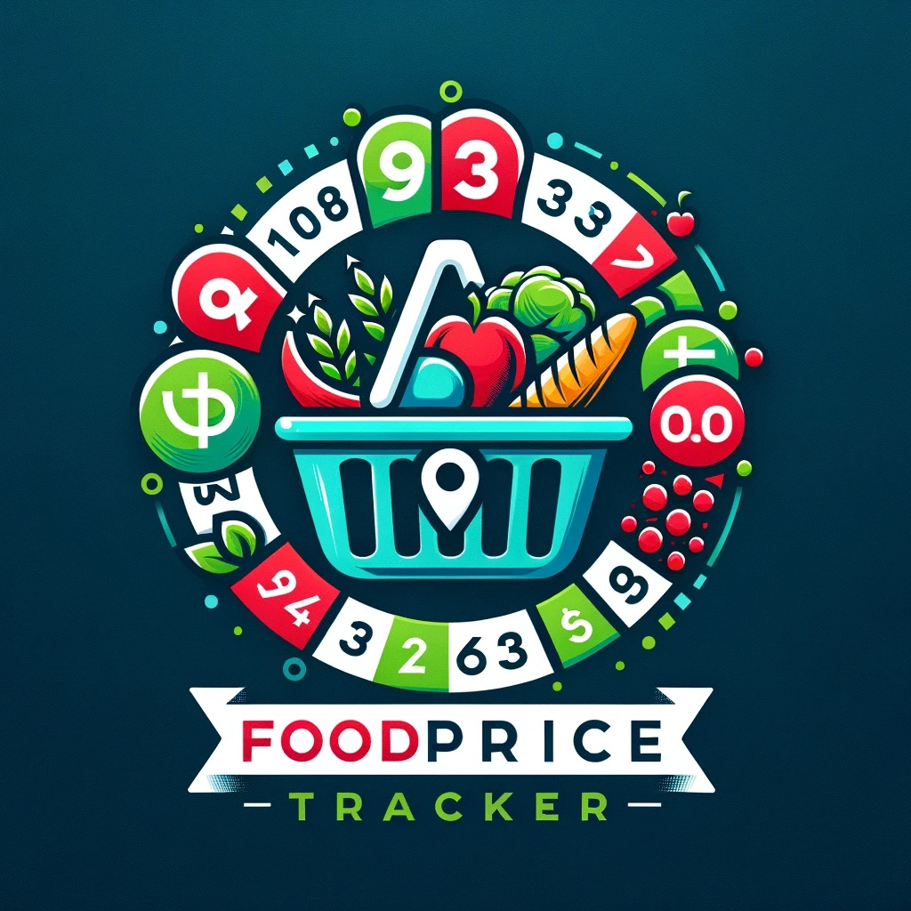

# Food Price Tracker 

** The web application is a revised version of the [Group project](https://github.com/UBC-MDS/DSCI-532_2024_19_food-price-tracker) with enhanced segmentations and functionalities using Python package [Streamlit](https://docs.streamlit.io/) **

Visualize and compare regional price trends across different regions worldwide.

## Welcome

Welcome to the Food Price Tracker project repository!
The project is dedicated to providing an intuitive and interactive data visualization platform aimed at offering insights into food price trends globally. 
By leveraging the Global Food Prices dataset, which is openly accessible via [The Humanitarian Data Exchange (HDX)](https://data.humdata.org/dataset/global-wfp-food-prices), the platform facilitates cross-sector collaboration to address various food-related challenges.
This dataset originates from the World Food Programme Price Database and encompasses pricing information for essential items such as maize, rice, beans, fish, and sugar.

We invite you to explore our Food Price Tracker and encourage contributions to enhance its functionality and utility. Thank you!

## Motivation and Purpose

Access to reliable food pricing information is essential for making informed decisions in public policymaking and business strategy. However, we have observed a lack of accessible online platforms offering comprehensive global food price trends with regional details. The main challenges identified include scattered and unorganized regional data which often require technical expertise to navigate effectively, and existing platforms that are not user-friendly for non-technical stakeholders.

To tackle these challenges, we have developed an interactive platform for tracking global food price trends with regional resolution. Our platform aims to empower stakeholders with insights to make informed decisions regarding food prices worldwide. We seek to foster collaboration across sectors to address food-related challenges on a global scale.

## Contributors

Tony Shum

## Usage - For Users

### Website Link

Food Price Tracker can be accessed through the following link: https://food-price-tracker-dashboard.streamlit.app/

The dashboard comprises a user input sidebar and a data display section. Within the sidebar, users can select their preferred country, view type (commodity-based, market-based), date range, specific commodities, and markets and the relative change metricsfor viewing. In the data display section, users can observe the actual and average values, as well as the relative change (e.g. Month-over-Month change rates), both for the Food Price Index and individual commodities, or for the Nationalw-wide overall and individual markets.

### Usage Demonstration

https://github.com/tonyshumlh/food_price_tracker_dashboard_streamlit/assets/38127942/62340447-5916-4b6e-984b-8325e083cf59

### Need Support?

If you want to report a problem or give an suggestion, we would love for you to [open an issue](../../issues) at this github repository and we will get on to it in a timely manner.

## Usage - For Developers

### Installation For Local Development

1. Clone this repository to your computer.

```bash
 git clone https://github.com/tonyshumlh/food_price_tracker_dashboard_streamlit.git
```
```bash
 cd food_price_tracker_dashboard_streamlit/
```

2. Install the conda environment.

```bash
 conda env create -f environment_local.yml
```

3. Activate the installed environment.

```bash
 conda activate food_price_tracker_indiv
```

4. Start the dashboard.

```bash
 streamlit run src/streamlit_app.py
```

### Contributing

Interested in contributing? Check out the [contributing guidelines](CONTRIBUTING.md). Please note that this project is released with a [Code of Conduct](CODE_OF_CONDUCT.md). By contributing to this project, you agree to abide by its terms.

## License

`food_price_tracker_indiv` was created by Tony Shum. It is licensed under the terms of the MIT license and the Attribution 4.0 International (CC BY 4.0 LEGAL CODE).

## Credits

Dataset from the Global Food Prices dataset, openly available on [The Humanitarian Data Exchange (HDX)](https://data.humdata.org/dataset/global-wfp-food-prices).

[`food_price_tracker`](https://github.com/UBC-MDS/DSCI-532_2024_19_food-price-tracker) was created by Celeste Zhao, John Shiu, Simon Frew, Tony Shum.

`food_price_tracker_indiv` was created with [`cookiecutter`](https://cookiecutter.readthedocs.io/en/latest/) and the `py-pkgs-cookiecutter` [template](https://github.com/py-pkgs/py-pkgs-cookiecutter). 
Logo was created by DALL.E.
